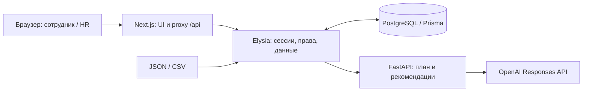

# Career Quest — Sparks

Прототип для **кейса 1 Career Quest, трек Halyk Bank, HackAlem AI**. Помогает сотруднику понять, каких навыков не хватает для выбранной роли и грейда, и выбрать подходящее обучение. HR получает сводку дефицитов и может загрузить дополнительные синтетические профили и историю для проверки.

Сотруднику сложно связать требования следующего грейда с каталогом обучения, а HR — увидеть, какие пробелы каталог не закрывает. Career Quest превращает профиль, карьерную цель и историю участия в объяснимые следующие шаги; после выполнения показывает фактическое изменение навыков.

## Демо и доступ

- **[Открыть опубликованную версию](https://hackalem.ispark.kz/ru)**.
- [Swagger API](https://hackalem.ispark.kz/api/docs) · [OpenAPI JSON](https://hackalem.ispark.kz/api/openapi.json) · [Состояние API](https://hackalem.ispark.kz/api/health).
- Репозиторий команды: [BAITC-Hacks/hack-7a870e4c-sparks](https://github.com/BAITC-Hacks/hack-7a870e4c-sparks).

Данные входа в опубликованную демоверсию:

| Роль | Логин | Пароль |
| --- | --- | --- |
| Сотрудник | `E0005` | `020e871b2d72aa780d6302c3e14b1a297474dc9a3371a3545140d6a2e9218c8f` |
| HR | `hr` | `9c72622c20a28fdf87af93750c951555382ac3df86b92cd59b05a1c5abe29f76` |

При локальном запуске используются `DEMO_EMPLOYEE_PASSWORD` и `HR_PASSWORD` из своего `.env`.

> **Проверено 23 сентября 2026 года:** публичный API доступен; работают вход обеих ролей, профиль, план, рекомендации, чат, HR-сводка и ограничения доступа. Рекомендации и чат вернулись в режиме `rules`, поэтому успешный ответ внешней модели не подтверждён. По `/ru` отображается исходный шаблон, а `/ru/login` и `/ru/employee` возвращают 404. Для веб-демо требуется публикация актуального frontend; ниже описана реализация текущего рабочего дерева и её локальный запуск.

API-ключи и `CREDENTIAL_SECRET` не публикуются в README или Git. `CREDENTIAL_SECRET` — серверный секрет начальных индивидуальных паролей, а не данные входа для жюри.

## Что реализовано

Реализованы профиль и карьерная цель, план развития с прогнозом навыков, до трех объяснимых рекомендаций, чат с карьерным консультантом, подтверждение завершения обучения, HR-сводка, каталог сотрудников с просмотром профиля и HR-импорт JSON/CSV. Интерфейс доступен на русском и казахском языках. Сотрудник имеет доступ только к собственным данным; публичных рейтингов результативности нет.

Сотрудник начинает с профиля и выбранной роли/грейда, получает разрывы в навыках и допустимые следующие шаги с объяснениями, затем подтверждает выполнение и видит пересчитанный профиль. HR видит агрегаты, может открыть профиль сотрудника и добавить синтетические данные для проверки.

Основные страницы имеют префикс `/ru` или `/kk`:

| Путь после префикса | Назначение |
| --- | --- |
| `/login` | Вход |
| `/employee` | Обзор сотрудника и рекомендации с факторами выбора |
| `/employee/profile` | Профиль, изменение цели, навыки и история |
| `/employee/career` | Карьерный путь, прогноз навыков и AI-советник |
| `/employee/activity/{id}` | Детали и демонстрационное завершение активности |
| `/hr` | HR-обзор: дефициты, участие, сотрудники без следующего шага |
| `/hr/employees` | Поиск, фильтры и просмотр профилей |
| `/import` | Импорт JSON/CSV, только HR |

## Архитектура

Frontend на TypeScript, Next.js 16 и React 19 использует Tailwind CSS 4, shadcn/ui, next-intl, nuqs и TanStack Query. Orval генерирует axios-клиент из OpenAPI. Запросы `/api/*` по умолчанию проходят через Next.js к Elysia API на Bun/TypeScript. API отвечает за cookie-сессии, права сотрудник/HR, профили, импорт и сохранение данных в PostgreSQL через Prisma.

API передает контекст выбранного сотрудника Python-агенту на FastAPI. Агент строит план, рассчитывает допустимые шаги и обращается к OpenAI Responses API со Structured Outputs; модель в Compose по умолчанию — `gpt-4.1-mini`. Только агент получает ключ OpenAI. При недоступности модели он продолжает подбор по правилам; при недоступности самого агента API сохраняет расчетные рекомендации, а план и чат возвращают 503. Резервный подбор API проще основного: например, он может предложить продолжить начатое обучение.

Модель выбирает мероприятия из допустимого набора и отвечает в чате. Код проверяет выбор, рассчитывает навыки, прогноз и объяснения по нескольким факторам: цель и дефициты, критичность навыков, история, условия участия. Если доступных шагов нет, возвращается пустой список с причиной. Сам карьерный план не требует вызова OpenAI.



| Компонент | Основные версии и библиотеки |
| --- | --- |
| Web | Next.js 16.3.6, React 19.3, TypeScript 5.9.3, Tailwind CSS 4, shadcn/ui, next-intl, Orval, Axios, TanStack Query, nuqs, Zod |
| API | Bun 1.3.14, Elysia 1.4.30, Prisma 7.10.0, pg, csv-parse, OpenAPI/Swagger |
| База данных | PostgreSQL 17, постоянный Docker volume |
| Агент | Python 3.12, FastAPI, Uvicorn, Pydantic, OpenAI Python SDK |
| Проверки | Vitest, React Testing Library, Playwright, Bun test, Python unittest, TypeScript |

`apps/web` содержит интерфейс, `apps/api` — API, миграции Prisma и HTTP-контракт, `apps/agent` — карьерного агента. Исходные данные находятся в `case_1/career_quest_dataset`, дополнительные проверочные профили — в `examples/jury`. `compose.yaml` и `init.sh` запускают все четыре сервиса.

API проверяет права до обращения к агенту. Сессия действует 12 часов и передаётся в HttpOnly cookie; пароли хешируются Argon2id. В PostgreSQL сохраняются профили, цели, история, аккаунты и сессии; завершение и импорт записываются транзакционно. Агент не изменяет БД. В OpenAI передаются карьерные факты и ограниченная история; имя и ID из профиля исключаются, текст чата передаётся как введён. Используется `store: false`.

## Запуск одной командой

Нужны Git, работающий Docker с Compose v2, поддерживающим `--wait`, и `openssl`. Node.js, Bun и Python на хосте для запуска в Docker не требуются. Первый запуск требует доступа к реестрам образов и зависимостей.

Получите репозиторий с актуальными изменениями. Текущая ветка реализации — `web`:

```bash
git clone --branch web git@github.com:BAITC-Hacks/hack-7a870e4c-sparks.git
cd hack-7a870e4c-sparks
```

Для клонирования нужен настроенный SSH-доступ к GitHub и права на репозиторий. Инструкция ниже относится к версии с сервисами `db`, `agent`, `api`, `web` в `compose.yaml`; локальные изменения должны быть отправлены в репозиторий перед воспроизведением на другой машине.

Из корня репозитория:

```bash
./init.sh
```

Скрипт создаст недостающие локальные пароли в `.env`, соберет и запустит frontend, API, PostgreSQL и Python-агент, дождется готовности и на macOS откроет [вход в Career Quest](http://localhost:3000/ru/login). Вариант без открытия браузера: `./init.sh --no-open`. Порт приложения по умолчанию — 3000 (`WEB_PORT`), API — 3001 (`API_PORT`). [Swagger](http://localhost:3001/api/docs) остается доступен отдельно. Остановка: `docker compose down`; данные PostgreSQL сохраняются.

Для AI-подбора добавьте `OPENAI_API_KEY` в корневой `.env`; при необходимости задайте `OPENAI_MODEL` (в Compose по умолчанию `gpt-4.1-mini`) и повторите запуск. Без ключа доступен расчетный режим. Настройки описаны в [.env.example](.env.example); секреты не нужно добавлять в Git.

При автоматическом запуске `init.sh` сам генерирует недостающие секреты. При ручной настройке замените заглушки `.env.example` своими значениями. Исходный датасет загружается только в пустую БД; повторный запуск сохраняет цели, историю и импорт. Изменение начального пароля в `.env` не меняет пароль уже созданного аккаунта.

### Переменные окружения

| Переменная | Назначение |
| --- | --- |
| `POSTGRES_PASSWORD` | Пароль БД; генерируется скриптом, при ручном задании должен быть URL-safe. |
| `HR_PASSWORD` | Начальный пароль `hr`, минимум 12 символов. |
| `CREDENTIAL_SECRET` | Серверный секрет генерации индивидуальных паролей, минимум 32 символа. |
| `DEMO_EMPLOYEE_ID` | Демонстрационный профиль, по умолчанию `E0005`. |
| `DEMO_EMPLOYEE_PASSWORD` | Отдельный начальный пароль демосотрудника, минимум 12 символов. |
| `OPENAI_API_KEY` | Ключ Python-агента; пустое значение включает расчётный режим. |
| `OPENAI_MODEL` | Модель, в Compose по умолчанию `gpt-4.1-mini`. |
| `APP_ORIGIN` | Точный origin браузера без `/ru`, например `https://hackalem.ispark.kz`. По умолчанию Compose использует `http://localhost` с портом `WEB_PORT`. |
| `COOKIE_SECURE` | `true` для HTTPS, `false` для локального HTTP. |
| `WEB_PORT`, `API_PORT` | Порты хоста: по умолчанию 3000 и 3001. |
| `WEB_BIND_ADDRESS`, `API_BIND_ADDRESS` | Интерфейсы публикации web/API, по умолчанию `127.0.0.1`. |
| `AGENT_URL` | Адрес агента для отдельного API; Compose использует `http://agent:8000`. |

Проверка состояния: `docker compose ps`; последние логи: `docker compose logs --tail=100 web api agent`. При занятом порте web: `WEB_PORT=3310 ./init.sh --no-open`. Если в `.env` явно задан `APP_ORIGIN`, его нужно согласовать с новым адресом. Данные сохраняются в volume `career_postgres_data`.

В Docker frontend обращается к API через внутренний адрес `http://api:3001`. Для отдельного запуска frontend используется серверная переменная `API_INTERNAL_URL` (по умолчанию `http://127.0.0.1:3001`); после ее изменения production-сборку нужно пересобрать. `NEXT_PUBLIC_API_URL` можно задать для прямого обращения браузера к отдельному API с настроенными CORS и cookies. Команды отдельного запуска — в [README frontend](apps/web/README.md).

В обычном запуске через proxy `NEXT_PUBLIC_API_URL` оставляется пустым. HTTPS и внешний reverse proxy настраиваются отдельно владельцем развёртывания. В текущем Compose агент публикует порт 8000 без пользовательской авторизации: пользовательские запросы должны идти через API, а внешний доступ к агенту следует ограничить.

## Сценарий проверки

1. Откройте [страницу входа](http://localhost:3000/ru/login). Войдите сотрудником `E0005` с паролем `DEMO_EMPLOYEE_PASSWORD` из локального `.env` (если `DEMO_EMPLOYEE_ID` не изменен).
2. На обзоре сотрудника откройте профиль, карьерный план и рекомендации; задайте вопрос консультанту. Интерфейс явно показывает расчетный режим при недоступности AI.
3. В деталях допустимого рекомендованного мероприятия подтвердите выполнение, сравните результат до/после и повторно откройте профиль. Навыки пересчитываются по сохраненной истории; повторное подтверждение не добавляет прирост второй раз.
4. Выйдите и войдите как `hr` с паролем `HR_PASSWORD`. Откройте HR-сводку и список сотрудников, примените поиск или фильтр, откройте профиль в боковой панели.
5. В разделе импорта выберите `employees.json` и `activity_history.csv` из [примеров жюри](examples/jury/). После отправки ожидаются 2 принятых профиля и 6 строк истории. На неизмененной исходной базе станет 202 сотрудника; повторный импорт обновляет те же ID. Найдите новые профили в HR-списке.

Это воспроизводимый сценарий, а не отчет о прохождении всех его шагов. Доступность API можно отдельно проверить через `GET /api/health` в Swagger: при доступном агенте без ключа ожидаются `status: "ok"`, `agent_available: true`, `ai_configured: false`. Значение `ai_configured: true` означает наличие ключа, а не подтверждённый ответ модели — для этого проверяйте `mode` рекомендаций.

В исходном наборе `E0005` — Backend Engineer Middle с целью Backend Engineer Senior. В профиле можно изменить или сбросить цель и проверить пересчёт плана. Для завершения выбирайте мероприятие из актуальных рекомендаций: результат зависит от истории и цели. Повторный API-запрос завершения возвращает `already_completed: true`. Сотрудник должен получать 403 на чужой профиль и HR-методы, после выхода — 401 на защищённые запросы.

Проверочные примеры содержат два профиля, подготовленных командой с помощью AI-агента; это не скрытые тесты Организатора:

- `JURY_BACKEND_ALPHA`: история без `completed_at` не повышает Python с исходного уровня 1; ежегодные обязательные участия остаются в истории.
- `JURY_QA_BETA`: допустимый `EV_018` развивает Test Automation с 3 до 4, а дефицит Test Design остаётся непокрытым каталогом.

Импорт не выдает учетные записи. Администратор может отдельно получить доступ к импортированному профилю, например:

```bash
docker compose exec api bun run credentials:employee JURY_QA_BETA
```

Вывод содержит пароль и передаётся приватно. Для API-импорта используйте `POST /api/hr/import` с полями `employees_json` и `history_csv`, содержащими текст файлов. Это JSON-запрос, не multipart; оба поля присутствуют, для отсутствующего файла передайте пустую строку. В Swagger сначала выполните `POST /api/auth/login` — он устанавливает cookie.

Точные маршруты, тела запросов, локальный запуск без Docker и команды проверок: [README API](apps/api/README.md). Формат контекста, логика подбора и запуск FastAPI: [README агента](apps/agent/README.md). Контракт для интеграции: [OpenAPI JSON](apps/api/openapi.json).

## Данные и ограничения

Источник — предоставленный [синтетический датасет Career Quest v1.0](case_1/career_quest_dataset/README.ru.md): 200 сотрудников, 60 навыков, 32 профиля требований для 8 ролей и 4 грейдов, 40 мероприятий, 2743 записи истории. Дата расчета берется из `meta.as_of_date` (`2026-10-01`), а не из системного времени. Данные разрешены только для хакатона; реальные персональные данные использовать нельзя.

### Правила навыков и рекомендаций

- `employee.skills` — оценка на `last_review_date`; отсутствующий навык равен 0. Прирост учитывается только для `completed` с известным `completed_at`, день которого строго позже оценки и не позже среза. История без точного времени сохраняется, но прирост не начисляет; профиль предупреждает о возможном недоучёте.
- Новое демонстрационное завершение получает время `as_of_dateT12:00:00.000Z`. Формула прироста: `max(текущий, min(текущий + gain, max_level, 5))`; предел мероприятия никогда не снижает достигнутый уровень.
- Покрытие требований: `100 × Σ min(текущий уровень, требуемый) / Σ требуемых уровней`, округление до 0,1. Это ориентир прототипа, не официальный порог или вероятность повышения.
- Явная цель может задавать смену роли. Без цели выбирается следующий грейд текущей роли; у Lead без цели следующей ступени нет, показывается отсутствие цели и шага.
- При отборе учитываются фактическая роль и грейд аудитории, prerequisites, история и доступные сессии. Для self-paced сессия не нужна. Python-агент исключает начатые и просроченные активности из новых шагов.
- Обязательные мероприятия не рекомендуются, их история и ежегодные повторы сохраняются. Повтор добровольного завершённого мероприятия разрешён для `EV_036`, не более одного раза за день среза.

Подтверждение выполнения демонстрационное, без проверки прохождения в LMS, записи на внешние мероприятия или автоматического повышения грейда.

HR-сводка показывает дефициты навыков, сотрудников без допустимого следующего шага и участие по мероприятиям. Количество участий — число записей истории, включая ежегодные повторы, а не уникальных сотрудников. Поиск и фильтры HR работают по полученному списку и сохраняются в URL; серверная пагинация не реализована.

Импорт принимает JSON-объект с массивом `employees` и CSV с исходными 10 колонками и необязательной `completed_at`. Можно загрузить один из файлов. До отправки frontend проверяет структуру, UTF-8 и лимиты 8 МиБ для общего содержимого и сериализованного JSON-запроса; полную проверку связей выполняет API перед атомарным сохранением. Результат считает принятые строки, включая обновления. После успеха связанные данные обновляются или удаляются из кеша для повторной загрузки.

Детали активности доступны для шага из текущих рекомендаций или карьерного плана; после завершения прямая ссылка показывает сохраненную историю. Каталог может не содержать обучения для отдельных дефицитов, например `SK_TEST_DESIGN`; приложение не создает вымышленные занятия или пороги повышения.

Диалог советника сохраняется только на текущем экране. Казахская локализация не охватывает все названия каталога, даты и серверные сообщения. Импорт работает в рамках текущего каталога и даты среза; редактор каталога и смена даты среза не реализованы. Корпоративных SSO/HRIS/LMS-интеграций, самостоятельной регистрации, баллов и наград нет. Ограничение попыток входа хранится в памяти одного API-процесса.

## Проверки

### Повторяемые команды

Из `apps/web` после установки зависимостей:

```bash
pnpm test:run
pnpm exec tsc --noEmit --incremental false
pnpm lint:deps
pnpm build
```

Из `apps/api` после установки зависимостей и генерации Prisma Client:

```bash
bun run typecheck
bun test tests/domain.test.ts tests/recommendations.test.ts
```

Из корня при работающем контейнере агента:

```bash
docker compose exec -T agent python -m unittest discover -s /app/agent/tests -v
```

Для полного прогона API нужна отдельная тестовая PostgreSQL БД в `TEST_DATABASE_URL`; `TEST_AGENT_URL` включает сквозные проверки FastAPI. Подготовка описана в [README API](apps/api/README.md#воспроизводимая-проверка). Тесты с подменой OpenAI не подтверждают живую внешнюю модель.

### Проверка при обновлении README, 23.09.2026

| Проверка | Результат |
| --- | --- |
| Web Vitest | 150 тестов в 17 файлах прошли. |
| Web TypeScript | Прошёл без ошибок. |
| API domain/recommendations | 48 тестов прошли. |
| Python-агент | 15 тестов прошли в работающем контейнере. |
| API TypeScript | Не прошёл: TS2345 в `apps/api/src/app.ts`, строки 36 и 40; `HTTPHeaders` несовместим с `Record<string, string>` в `applyCors`. |
| Публичный API | Вход `E0005`/`hr`, профиль, план, рекомендации, чат, HR-сводка, список и выход работают; запрещённые запросы сотрудника вернули 403. |
| Внешняя модель | Health: `ai_configured: true`; рекомендации и чат: `mode: rules`. Ответ OpenAI не подтверждён. |
| Публичный web | `/ru` показывает исходный шаблон; `/ru/login` и `/ru/employee` — 404. Полный веб-сценарий не проверен. |

Рекомендации и чат в единичных публичных запросах заняли около 8,3–8,5 секунды. Это не нагрузочный тест и не подтверждение стабильного соблюдения требований UI ≤2 с и AI ≤10 с. В ходе этой проверки цели, история и импорт на публичной БД не изменялись. Production build, Playwright, `lint:deps` и полный прогон с тестовой PostgreSQL повторно не запускались.

### Ранее зафиксированные проверки разработки

При реализации стадий 5/6 и подготовке запуска стадии 7 прошли TypeScript frontend, проверка зависимостей (`pnpm lint:deps`, 230 модулей), production build и Biome для 33 измененных TS/TSX/JSON-файлов. Повторная генерация Orval не изменила клиент. На этом этапе по указанию пользователя тесты не создавались и не запускались.

Полный запуск `./init.sh --no-open` проверен в отдельном Compose-проекте `career-stage7-check` с новой БД и портами frontend 3310 / API 3311: все четыре контейнера достигли healthy. В production-интерфейсе вручную выполнены вход HR, поиск сотрудника, открытие профиля с навигацией назад/вперед и reload, а также импорт примеров жюри: предпросмотр и ответ сервера показали 2 профиля и 6 строк истории. Проверка выполнена без ключа OpenAI и подтверждает локальные сценарии, а не публичное развертывание или живую модель.

После импорта HR-сводка обновилась с 200 до 202 сотрудников: поиск `JURY_` показал 2/202, фильтр Middle — 1/202 с `grade` в URL; профиль `JURY_QA_BETA` открылся в панели только для чтения с предупреждением о `SK_TEST_DESIGN`. Мобильный список визуально проверен на ширине 390 px, переход RU → ҚАЗ сохранил фильтры; полный сценарий сотрудника пока не завершен.

Исторические результаты объединения стадий 3/4 — 150 unit/component tests и 54 Playwright-сценария в Chromium desktop/mobile — описаны в [README frontend](apps/web/README.md) и не являются проверкой текущих изменений. Они также не подтверждают живой OpenAI, полный сценарий web → API или публичное развертывание. Общие `lint`/`lint:unused` сохраняют ранее отмеченные замечания исходного шаблона.

Подробнее: [политика данных](docs/data-policy.md) и [контракт API](docs/api-contract.md).

## Внешние материалы и интеграции

Внешний сервис рабочего сценария — OpenAI API; при его недоступности остаётся расчётный режим. Реальных интеграций с корпоративными HR-системами, LMS, календарями и мессенджерами нет.

- Frontend основан на предоставленном пользователем [Crystal Architecture v2](https://github.com/Bedroom-Developers/frontend_template_crystal_architecture), исходный commit `df87a460210ab3a2f6b798c483572f8b50161b01`. Команда реализовала на его основе экраны Career Quest и работу с API. Шаблон частный, отдельная открытая лицензия не установлена; условия дальнейшего распространения требуют уточнения у владельца.
- Сохранена модульная структура предоставленного API-шаблона `auth-service`; доменные сервисы реализованы для Career Quest. Отдельный источник и лицензия шаблона не установлены.
- Датасет и документы кейса — материалы Организатора, а не разработка команды. Дополнительные примеры `examples/jury` созданы для проверки импорта.
- Сторонние зависимости перечислены в [web package.json](apps/web/package.json), [API package.json](apps/api/package.json) и [requirements.txt агента](apps/agent/requirements.txt); их лицензии и уведомления сохраняются. Общая лицензия всему проекту не назначена.
- Разработка и проверки выполнялись с помощью AI-агента Codex. Это раскрытие используемого инструмента, а не утверждение о персональном вкладе участников.

Ближайшие действия для готового публичного демо: опубликовать актуальный frontend, исправить ошибку проверки типов API, подтвердить живой ответ модели и пройти весь сценарий по внешней ссылке. Отправка кода в GitHub и сдача решения на платформе хакатона — отдельные действия.
